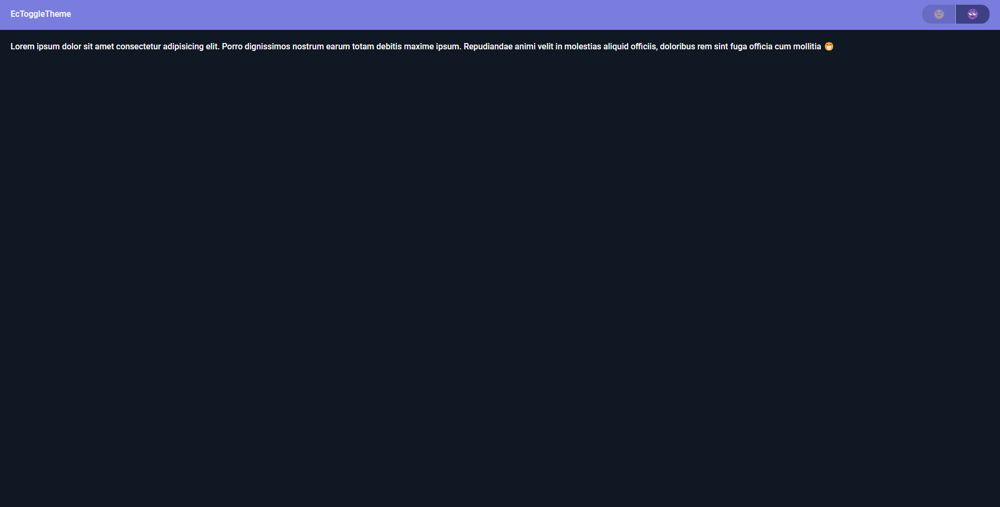

# ECToggleTheme



**ECToggleTheme** is a powerful utility enabling seamless switching between light and dark themes in web applications. Developed using JavaScript, HTML, SCSS, and Webpack, this project enhances user experience with dynamic theme transitions from the moment you open the page.

## Technology

Discover the key technologies and tools utilized in building ECToggleTheme:

- **HTML/Javascript/SCSS**: Core technologies for dynamic web functionality and styling.
- **Webpack**: Bundles and optimizes JavaScript and Sass files, ensuring smooth theme transitions.

## Features

- **Light and Dark Themes**: Seamlessly toggle between two visually distinct themes.
- **User-Friendly Interface**: Intuitive design with a switch button located on the right side of the navbar for easy theme selection.

## Viewing Locally

To experience ECToggleTheme locally, follow these steps:

1. Clone the repository:

   ```bash
       git clone https://github.com/edsoncamargo/ECToggleTheme
       cd your-path/ECToggleTheme
   ```

2. Install the dependencies:

   ```bash
       npm install
   ```

3. Start the development server:

   ```bash
       npm run build:dev
   ```

- Install Live Server in VSCode extensions with `@recommended` and launch `index.html` 🚀

## Contribution

Contributions to refine and expand ECToggleTheme are encouraged. Feel free to open issues, suggest features, or submit pull requests to improve the project.

## License

This project is licensed under the [MIT LICENSE](./LICENSE).

## Contact

- Name: Edson Camargo Menezes
- Email: contact@edsoncamargo.dev

Elevate user experience with ECToggleTheme and create a visually engaging web environment 🎨
